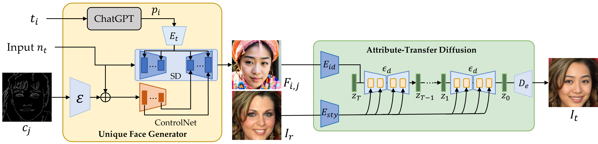
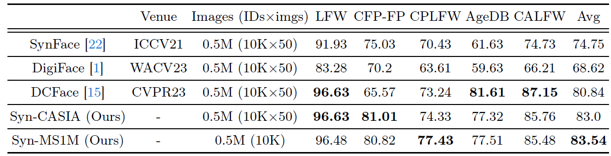

# Attribute-Transfer Diffusion with Formulated Prompts for Face Synthesis

> **Abstract:** We propose an innovative approach to address the limitations associated with real-world facial data, particularly concerning issues of data imbalance, privacy concerns, and the annotation of attributes such as ethnicity, gender, and age. Our methodology comprises two interdependent modules: the Unique Face Generator (UFG) and the Attribute-Transfer Diffusion Model (ATD). The UFG is meticulously configured to generate unique frontal faces, each precisely tailored to specified ethnicity, gender, and age intervals. Leveraging advanced techniques including ChatGPT for prompt generation, ControlNet for steering the synthesis process, and Stable Diffusion for enhanced stability and realism, the UFG ensures the creation of diverse and realistic facial representations. Subsequently, the UFG-generated faces serve as input for the ATD module, which excels in duplicating styles from a given set of reference faces onto the input face while meticulously preserving the original facial identity. Our approach not only ensures the preservation of identity information within specific demographic groups but also enhances the diversity of the generated faces, effectively mitigating issues of data imbalance and privacy concerns prevalent in real-world datasets. To evaluate the efficacy of our approach, we curated three synthetic datasets, namely Syn-MPIE, Syn-MS1M, and Syn-CASIA, and compared them with their real-world counterparts for face recognition tasks. Through comprehensive comparative analyses against state-of-the-art methods, we demonstrate the distinct advantages and efficacy of our proposed approach. By integrating cutting-edge technologies such as ChatGPT, ControlNet, and Stable Diffusion, our approach offers a novel and effective solution for generating synthetic faces with unparalleled diversity, fidelity, and utility.
>
> 
## Getting Started
- Clone the repo:
    ```
    git clone https://github.com/ECCV-ATD/Attribute-Transfer-Diffusion-with-Formulated-Prompts-for-Face-Synthesis.git
    ```
## Installation
```python
conda create --name ATD python=3.9
conda activate ATD
pip install -r requirements.txt
```
## Pretrained Models
| Architecture | Dataset      | Images (IDs×imgs)      | Link
|--------------|--------------|-----------|-----------|
| LResNet50E-IR          | Syn-MS1M | 0.5M (10K) | [Google Drive](https://drive.google.com/file/d/1BLUrw2-WTZj_r0duDQeYx-7JVxy-3tHg/view?usp=sharing) |
| LResNet50E-IR          | Syn-CASIA | 0.5M (10K×50) | [Google Drive](https://drive.google.com/file/d/1FNkr3YIX2QcTgd9Up8MLeG23DhyI2Ptn/view?usp=sharing) |
| LResNet50E-IR          | Syn-MPIE | 0.36M (2K×182) | [Google Drive](https://drive.google.com/file/d/1MPU8gNiK9E1sBe_p6kLj4juPMR4o_nQF/view?usp=sharing) |

## Training Datasets
- Syn-MS1M (10K ids/0.5M images)
  - [Google Drive](https://drive.google.com/drive/folders/16z9t4tR7McY5HSD-u-CvL8CYMNwxx3sT?usp=sharing)

- Syn-MPIE (2K ids/0.36M images)
  - [Google Drive](https://drive.google.com/drive/folders/1NQgHm_CM7zgnXtq_Vs5K6Y3s3zmEu8ZT?usp=sharing)

## Validation (LFW, CFPFP, CPLFW, CALFW, AGEDB)
Please download the validation set from [insightface](https://github.com/deepinsight/insightface/tree/master/recognition/_datasets_)
```python
python verification_torch.py
```
## Comparison with SOTA Models 

Verification accuracy on benchmarks of Our FR model with SOTA method.Our approach shows superior handling of cross-pose challenges, notably in the CFPFP
benchmark, while DCFace is particularly adept with the age variations in AgeDB. The data reflects Syn-MS1M’s consistently higher accuracy, underscoring
the effectiveness of our approach in diverse face recognition scenarios.
